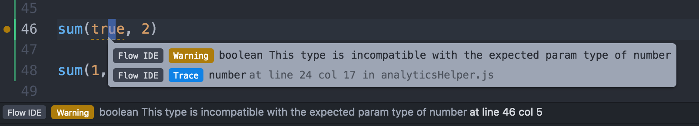

# Pruebas son buenas, pero imposible es mejor
<hr />
<h4 class="subtitle">yendo más allá con tipos</h4>

---

Nuestro Ejemplo

```js
function sendAnalytics (page, action, label, id, isError) {
  if (!label || !action || !page) {
    throw new Error('Cannot send event')
  }
  //(...)
}
```

Note: our example

----

¿Cuál es la orden? Label después de action?

```js
sendAnalytics('home', 'click', 'next')
sendAnalytics('faq', 'click', 'not-found', 123, true)
sendAnalytics('step4', 'submit', 'buying', null, false)
```

Note: using the function. you have to check the order and types

----

¡Error!

```js
sendAnalytics('step4')
sendAnalytics('step4', 'click')
sendAnalytics()
```

```
Uncaught Error: Cannot send event
```

Note: Forget something and it will throw an error

----

Muchos escenarios -> muchas pruebas

```js
describe('sendAnalytics', () => {
  context('correct arguments', () => {
    //(...)
  })
  context('incorrect arguments', () => {
    it('throws error when receives only page', () => {...})
    it('throws error when receives only label', () => {...})
    it('throws error when receives only action', () => {...})
    it('throws error when receives only page and label', () => {...})
    it('throws error when receives only page and action', () => {...})
    it('throws error when receives only label and action', () => {...})
  })
})
```

```js
describe('A component', () => {
  it('sends data to analytics', () => {
    expect(sendAnalytics).toHaveBeenCalledWith('home', 'click', 'next')
  })
})
```

Note: A lot of tests for coverage all the scenarios

----

Mismo con verificación de parámetros y pruebas...

```js
// forced to pass id null
sendAnalytics('step4', 'submit', 'buying', null, true)

// wrong values
sendAnalytics('faq', 123, true, 'not-found')
```

Note: even with tests we can have a lot of issues

---

## Empezar la refactorización

----

Objeto como parámetro

```js
function sendAnalytics (data) {
  console.log(data.page)
  console.log(data.action)
  //(...)
}
```

```js
const sendAnalytics = ({page, action, label, id, isError}) => {
  console.log(page)
  console.log(action)
  //(...)
}
```
¡Babel es mi lenguaje!

Note: object as argument

----

La orden no es más importante
```js
sendAnalytics({page: 'home', action: 'click', label: 'next'})
sendAnalytics({page: 'step4', action: 'submit', label: 'buying', isError: false})
sendAnalytics({page: 'faq', action: 'click', label: 'not-found', id: 123, isError: true})
```

----

Pero aún tenemos errores

```js
sendAnalytics({page: 'step4'})
sendAnalytics({page: 'step4', action: 'click'})
sendAnalytics()
```

```
Uncaught Error: Cannot send event
```

----

```js
sendAnalytics('step4', 'submit', 'buying', null, true) // forced to pass id null

sendAnalytics('faq', 123, true, 'not-found') // wrong values
```

Mejora algo

```js
sendAnalytics({page: 'faq', action: 123, label: true, id: 'not-found'})

sendAnalytics({page: 'step4', action: 'submit', label: 'buying'}) // wrong values
```

---


----

- Static Type Checker
- Created by Facebook (React también!)

----

Pequeño ejemplo

```js
const sum = (a, b) => a + b
```

```js
const sum = (a: number, b: number): number => a + b
```

```js
sum(2, 3)
```

----

```sh
npm run flow
```

flow server -> flow status -> shell, editor

----

y si...

```js
sum(true, 3)
```


----



----

Intentando usar

```js
const sendAnalytics = (data: {page: string, action: string, label: string, id: number, isError: boolean}) => {
  //(...)
}
```

----

¡alias!

```js
type Event = {
  page: string,
  action: string,
  label: string,
  id: number,
  isError: boolean
}

const sendAnalytics = (data: Event) => {
  //(...)
}
```

----

Todos los parámetros

```js
sendAnalytics({page: 'step4', action: 'submit', label: 'buying', isError: false})
```

----

? para llaves opcionales

```js
type Event = {
  page: string,
  action: string,
  label: string,
  id?: number,
  isError?: boolean
}

const sendAnalytics = (data: Event) => {
  //(...)
}
```

----

Más flexible

```js
sendAnalytics({page: 'faq', action: 'click', label: 'question'})
sendAnalytics({page: 'faq', action: 'click', label: 'question', id: 1234})
```

Pero...

```js
// ZID
sendAnalytics({page: 'faq', action: 'click', label: 'question', ZID: 1234})

//category
sendAnalytics({page: 'faq', action: 'click', label: 'question', category: 'beta'})
```

----

Objeto Exacto

```js
type Event = {|
  page: string,
  action: string,
  label: string,
  id?: number,
  isError?: boolean
|}
```

----

Borrando pruebas

```js
describe('sendAnalytics', () => {
  context('correct arguments', () => {
    //(...)
  })
  context('incorrect arguments', () => {
    it('throws error when receives only page', () => {...})
    it('throws error when receives only label', () => {...})
    it('throws error when receives only action', () => {...})
    it('throws error when receives only page and label', () => {...})
    it('throws error when receives only page and action', () => {...})
    it('throws error when receives only label and action', () => {...})
  })
})
```

```js
describe('sendAnalytics', () => {
  //(...)
})
```

----

empezar con algunos archivos

```js
// @flow

const sendAnalytics(...) = () => {
```

```js
// @flow

sendAnalytics(...)
```

```js
// @flow

sendAnalytics({id: sum(a, b)})
```
más archivos usando -> verificación de integración entre ellos

----

```js
Uncaught Error: Cannot send event
```

```js
undefined is not a function
```

----

las notas del flow se borran

```js
type Event = {|
  page: string,
  action: string,
  label: string,
  id?: number,
  isError?: boolean
|}

const sendAnalytics = (data: Event) => {
  //(...)
}
```

```js
const sendAnalytics = (data) => {
  //(...)
}
```

----

* Editores: Vim, Emacs, Sublime, Atom, Visual Studio Code, IntelliJ (syntax)
* Alternativa: TypeScript (Microsoft)

---

## ¿The end?

----

Functions

```js
type sendAnalytics = (Event) => void
const sendAnalytics: sendAnalytics = (data) => {
```

Arrays y Tuples

```js
Array<number>
[string, number]
var foo: string = "Hello, World!";
```

React

```js
type Props = {
  title: string,
  visited: boolean,
  onClick: () => void,
};

class Button extends React.Component {
  props: Props;
  state: {
   display: 'static' | 'hover' | 'active';
 }
```

----

github **@roberto**

twitter **@bt1**

React, Redux, Elm, Functional Programming, Babel,
Flow, Ruby, Haskell, Continuous Delivery, Buenas Practicas, TDD,
Juegos de Mesa, Videojuegos
